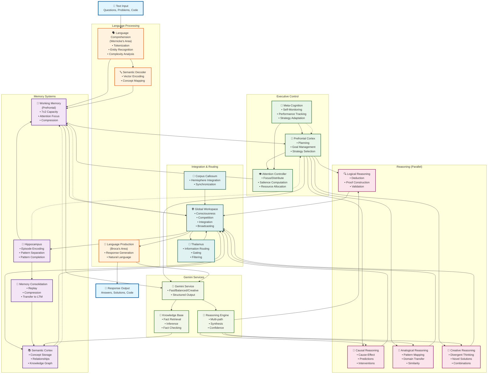
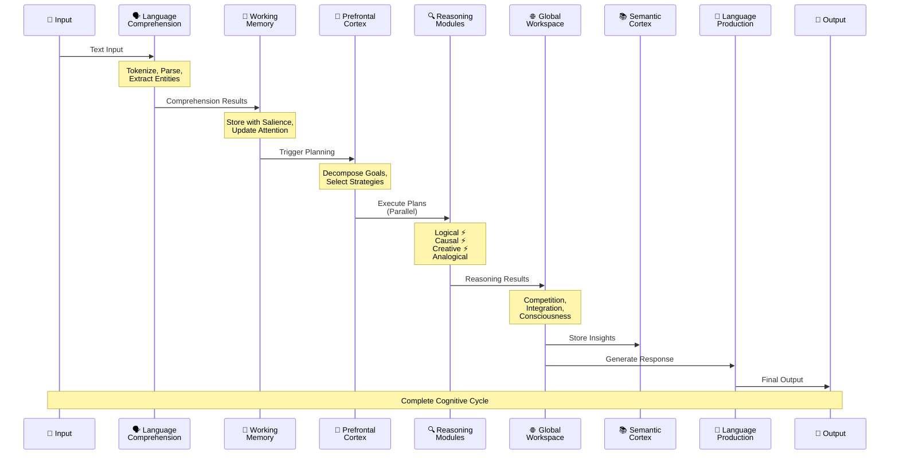

# 🧠 Complete Cognitive Digital Brain Architecture



## 📊 Data Flow Sequence Diagram



## 🔄 Key Information Flows

### 1. **Forward Flow** (Input → Output)
```
Text → Comprehension → Working Memory → Executive Planning 
→ Parallel Reasoning → Global Integration → Response Generation
```

### 2. **Memory Loops**
```
Working Memory ↔ Hippocampus (episodic encoding)
Hippocampus → Consolidation → Semantic Cortex (long-term storage)
Semantic Cortex → Working Memory (knowledge retrieval)
```

### 3. **Executive Control Loops**
```
Prefrontal Cortex → Attention Controller → Working Memory
Meta-Cognition → Prefrontal Cortex (strategy adaptation)
Global Workspace → Prefrontal Cortex (feedback)
```

### 4. **Integration Pathways**
```
All Regions → Thalamus (routing/filtering) → Global Workspace
Global Workspace → All Regions (broadcasting)
Left/Right Processing → Corpus Callosum → Integration
```

## 🎯 Special Features Highlighted

### Parallel Processing
- **Reasoning modules** execute simultaneously
- Different strategies explore solution space concurrently
- Results compete for global attention

### Feedback Mechanisms
- Dotted lines show feedback paths
- Meta-cognition monitors and adjusts strategies
- Global workspace broadcasts influence all regions

### Memory Hierarchy
1. **Working Memory**: Immediate, limited capacity
2. **Hippocampus**: Episodic, pattern-based
3. **Semantic Cortex**: Long-term conceptual knowledge

### Gemini Integration Points
- Augments reasoning with vast knowledge
- Provides language generation capabilities
- Enables structured thinking and synthesis

This architecture mimics biological brain organization while leveraging modern AI capabilities for enhanced reasoning!